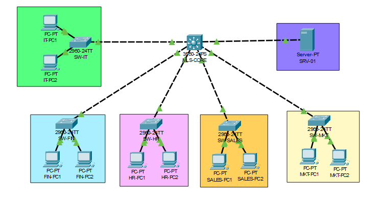

# Enterprise Network Security

Implementasi keamanan dasar pada jaringan enterprise sebagai lanjutan dari **Enterprise Network Cisco Packet Tracer**. Project ini berfokus pada penerapan mekanisme keamanan untuk melindungi akses administrasi, komunikasi antar VLAN, dan perangkat jaringan sesuai praktik dasar pada lingkungan enterprise.

---

## 1. Project Overview

Project ini mengembangkan topologi jaringan enterprise yang telah dibangun pada Project 1 dengan menambahkan berbagai mekanisme keamanan dasar. Implementasi difokuskan pada pengamanan akses administrator, pembatasan komunikasi berdasarkan kebijakan jaringan, perlindungan access port, serta penerapan konfigurasi keamanan yang bertujuan meningkatkan keamanan dan kemudahan pengelolaan perangkat jaringan.

---

## 2. Objectives

- Mengamankan akses administrasi perangkat menggunakan Secure Shell (SSH).
- Menerapkan Standard Access Control List (ACL) untuk membatasi akses administrasi.
- Menerapkan Extended Access Control List (ACL) untuk mengontrol komunikasi antar VLAN.
- Menggunakan Management VLAN sebagai jalur administrasi perangkat jaringan.
- Melindungi access port menggunakan Port Security.
- Mengamankan konfigurasi perangkat dengan Password Encryption.
- Menampilkan Login Banner sebagai peringatan keamanan.
- Menonaktifkan port yang tidak digunakan untuk mengurangi potensi akses fisik yang tidak sah.

---

## 3. Network Topology



---

## 4. Security Features

Project ini mengimplementasikan beberapa mekanisme keamanan dasar yang umum diterapkan pada jaringan enterprise, antara lain:

- Secure Shell (SSH)
- Standard Access Control List (ACL)
- Extended Access Control List (ACL)
- Management VLAN
- Port Security
- Password Encryption
- Login Banner
- Disable Unused Ports

---

## 5. Project Structure

```text
Enterprise-Network-Security/
│
├── docs/
│   ├── project-documentation.md
│   ├── security-policy.md
│   ├── testing-results.md
│   └── development-journal.md
│
├── screenshots/
│
├── Enterprise-Network-Security.pkt
│
└── README.md
```

---

## 6. Development Environment

|       Software      | Version |
|---------------------|---------|
| Cisco Packet Tracer | 8.2.2   |

---

## 7. Technical Skills

- **Switching**
  - VLAN
  - Trunk

- **Security**
  - SSH
  - Standard ACL
  - Extended ACL
  - Port Security
  - Password Encryption
  - Login Banner

- **Management**
  - Management VLAN

---

## 8. Project Documentation

Dokumentasi lengkap project tersedia pada file berikut.

|          Document          |                              Description                               |
|----------------------------|------------------------------------------------------------------------|
| "project-documentation.md" | Dokumentasi implementasi seluruh mekanisme keamanan.                   |
| "security-policy.md"       | Kebijakan keamanan yang diterapkan pada lingkungan jaringan.           |
| "testing-results.md"       | Hasil pengujian seluruh implementasi keamanan beserta bukti pengujian. |
| "development-journal.md"   | Catatan proses pengembangan dan troubleshooting project.               |

---

## 9. Project Status

|          Item         |  Status   |
|-----------------------|-----------|
| Network Configuration | Completed |
| Documentation         | Completed |
| Testing               | Completed |

---

## 10. Portfolio Series

Repository ini merupakan bagian dari rangkaian project portofolio **Network Infrastructure** yang dikembangkan secara bertahap untuk mendokumentasikan proses pembelajaran dan implementasi teknologi jaringan.
