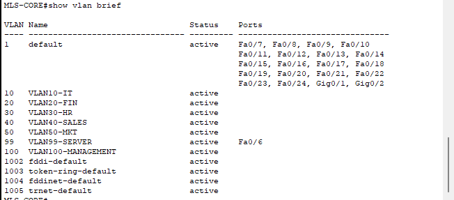

# Project Documentation

## 1. Deskripsi Project

**Enterprise Network Security** merupakan simulasi implementasi keamanan jaringan perusahaan menggunakan Cisco Packet Tracer. Project ini merupakan lanjutan dari **Enterprise Network Cisco Packet Tracer**, yang berfokus pada pembangunan infrastruktur jaringan perusahaan.

Berbeda dengan project sebelumnya yang berfokus pada pembangunan topologi dan komunikasi antar perangkat, project ini berfokus pada penerapan berbagai mekanisme keamanan jaringan yang umum digunakan pada lingkungan enterprise. Implementasi dilakukan untuk melindungi akses administrasi perangkat, mengontrol komunikasi antar divisi, membatasi penggunaan access port, serta meningkatkan keamanan konfigurasi perangkat jaringan.

Seluruh implementasi dilakukan menggunakan fitur-fitur keamanan Cisco, meliputi **Secure Shell (SSH)**, **Standard Access Control List (ACL)**, **Extended Access Control List (ACL)**, **Management VLAN**, **Port Security**, **Password Encryption**, **Login Banner**, dan **Disable Unused Ports**.

---

## 2. Tujuan Project

Project ini bertujuan untuk mengimplementasikan mekanisme keamanan jaringan dasar pada lingkungan enterprise menggunakan Cisco Packet Tracer.

Adapun tujuan yang ingin dicapai pada project ini adalah sebagai berikut.

- Mengamankan akses administrasi perangkat menggunakan Secure Shell (SSH).
- Membatasi akses administrator menggunakan Standard Access Control List (ACL).
- Mengontrol komunikasi antar VLAN menggunakan Extended Access Control List (ACL).
- Memisahkan jalur administrasi perangkat melalui Management VLAN.
- Mengamankan access port menggunakan Port Security.
- Melindungi password konfigurasi perangkat menggunakan Password Encryption.
- Menampilkan Login Banner sebagai peringatan keamanan sebelum proses autentikasi.
- Menonaktifkan port yang tidak digunakan untuk mengurangi potensi akses fisik yang tidak sah.

---

## 3. Gambaran Topologi

Topologi yang digunakan pada project ini merupakan pengembangan dari **Enterprise Network Cisco Packet Tracer**. Infrastruktur jaringan tetap menggunakan satu **Multilayer Switch** sebagai core switch dan beberapa **Access Switch** yang mewakili masing-masing divisi perusahaan.

Pada implementasi kali ini, fokus utama bukan pada pembangunan topologi, melainkan pada penerapan berbagai mekanisme keamanan untuk meningkatkan keamanan jaringan tanpa mengubah desain infrastruktur yang telah dibangun sebelumnya.

**Hasil Pengamatan**

Berdasarkan topologi di atas, jaringan terdiri dari satu Multilayer Switch sebagai pusat komunikasi antar VLAN dan beberapa Access Switch yang melayani masing-masing divisi perusahaan. Seluruh mekanisme keamanan diterapkan pada perangkat yang relevan sesuai kebutuhan administrasi dan kebijakan keamanan jaringan perusahaan.

---

## 4. Konfigurasi VLAN

Konfigurasi VLAN pada project ini tetap menggunakan segmentasi jaringan yang telah dibangun pada **Project 1**. Masing-masing divisi masih dipisahkan ke dalam VLAN yang berbeda untuk menjaga keteraturan lalu lintas jaringan dan mempermudah pengelolaan perangkat.

Perbedaan utama pada project ini adalah penambahan **Management VLAN (VLAN 100)** yang digunakan sebagai jalur khusus administrasi perangkat jaringan. Dengan adanya VLAN ini, aktivitas manajemen perangkat dapat dipisahkan dari lalu lintas pengguna sehingga keamanan administrasi jaringan dapat ditingkatkan.

Walaupun screenshot berikut menampilkan seluruh konfigurasi VLAN, fokus implementasi pada project ini berada pada **Management VLAN (VLAN 100)** sebagai bagian dari mekanisme keamanan jaringan.

**Hasil Pengamatan**

Konfigurasi VLAN menunjukkan bahwa jaringan telah dipisahkan berdasarkan fungsi dan divisi masing-masing. Selain itu, **Management VLAN (VLAN 100)** berhasil ditambahkan sebagai jalur administrasi perangkat sehingga lalu lintas manajemen dipisahkan dari jaringan pengguna tanpa mengubah segmentasi jaringan yang telah dibangun sebelumnya.

---

## 5. Implementasi Keamanan

### 5.1 Secure Shell (SSH)

Secure Shell (SSH) merupakan protokol yang digunakan untuk melakukan administrasi perangkat jaringan secara remote melalui komunikasi yang terenkripsi. Dibandingkan dengan Telnet, SSH memberikan perlindungan terhadap proses autentikasi dan pertukaran data sehingga lebih aman digunakan pada lingkungan enterprise.

Pada project ini, layanan SSH dikonfigurasi pada Multilayer Switch dan seluruh Access Switch agar administrator dapat melakukan pengelolaan perangkat dari jaringan administrasi tanpa harus menggunakan koneksi console secara langsung.

**Tujuan Implementasi**

Implementasi SSH bertujuan untuk menyediakan akses administrasi yang aman, mengurangi risiko penyadapan kredensial administrator, serta menerapkan metode remote management yang sesuai dengan praktik umum pada jaringan enterprise.

**Hasil Pengujian**

Hasil pengujian menunjukkan bahwa administrator dapat melakukan remote login ke Multilayer Switch menggunakan akun yang telah dikonfigurasi. Proses autentikasi berjalan melalui protokol SSH sehingga komunikasi administrasi tidak lagi menggunakan koneksi plaintext.

**Hasil Pengujian**

Pengujian juga menunjukkan bahwa seluruh Access Switch dapat diakses menggunakan SSH melalui jaringan administrasi. Dengan konfigurasi ini, proses pengelolaan perangkat dapat dilakukan secara terpusat tanpa harus terhubung langsung ke masing-masing switch.

---

### 5.2 Standard Access Control List (ACL)

Standard Access Control List (ACL) digunakan untuk membatasi akses berdasarkan alamat IP sumber. Pada implementasi ini, Standard ACL diterapkan untuk mengontrol perangkat yang diperbolehkan melakukan administrasi perangkat jaringan melalui layanan SSH.

**Tujuan Implementasi**

Implementasi Standard ACL bertujuan agar hanya administrator dari jaringan yang telah ditentukan yang dapat mengakses perangkat jaringan. Pembatasan ini membantu mengurangi kemungkinan akses administrasi dari host yang tidak memiliki otorisasi.

**Hasil Pengujian**

Berdasarkan hasil pengujian, hanya perangkat dari VLAN IT yang dapat melakukan koneksi SSH ke perangkat jaringan. Percobaan akses dari VLAN lain ditolak sesuai dengan aturan Standard ACL yang telah diterapkan.

---

### 5.3 Extended Access Control List (ACL)

Extended Access Control List (ACL) digunakan untuk melakukan penyaringan lalu lintas jaringan berdasarkan alamat IP sumber, alamat IP tujuan, maupun jenis layanan yang digunakan. Pada project ini, Extended ACL diterapkan untuk mengatur komunikasi antar divisi sesuai dengan kebutuhan operasional perusahaan.

**Tujuan Implementasi**

Implementasi Extended ACL bertujuan untuk membatasi komunikasi yang tidak diperlukan antar VLAN sehingga setiap divisi hanya dapat mengakses layanan atau jaringan yang memang diizinkan sesuai kebijakan keamanan perusahaan.

**Hasil Pengujian**

Hasil pengujian menunjukkan bahwa komunikasi antar VLAN telah mengikuti aturan yang dikonfigurasi. Akses yang diizinkan dapat berjalan dengan normal, sedangkan komunikasi yang tidak sesuai kebijakan keamanan berhasil diblokir oleh Extended ACL.

---

### 5.4 Management VLAN

Management VLAN (VLAN 100) digunakan sebagai jalur khusus administrasi perangkat jaringan. Seluruh alamat IP manajemen pada Multilayer Switch dan Access Switch ditempatkan pada VLAN ini sehingga proses administrasi dipisahkan dari lalu lintas pengguna.

**Tujuan Implementasi**

Implementasi Management VLAN bertujuan untuk meningkatkan keamanan administrasi perangkat dengan memisahkan lalu lintas manajemen dari jaringan pengguna. Pendekatan ini juga mempermudah proses pengelolaan perangkat oleh administrator.

**Hasil Pengujian**

Pengujian menunjukkan bahwa seluruh perangkat jaringan menggunakan VLAN 100 sebagai jalur administrasi. Administrator dapat melakukan pengelolaan perangkat melalui jaringan manajemen tanpa mengganggu lalu lintas pengguna pada VLAN lainnya.

---

### 5.5 Port Security

Port Security merupakan fitur keamanan Layer 2 yang digunakan untuk membatasi perangkat yang diperbolehkan menggunakan suatu access port. Pada implementasi ini, setiap access port dikonfigurasi agar hanya menerima satu alamat MAC menggunakan mekanisme **Sticky MAC Address**.

**Alasan Implementasi**

Port Security diterapkan untuk mencegah perangkat yang tidak sah menggunakan access port perusahaan. Dengan membatasi jumlah perangkat pada setiap port, risiko penyalahgunaan akses fisik dapat dikurangi serta membantu menjaga keamanan jaringan internal.

**Hasil Pengujian**

Pengujian dilakukan dengan menghubungkan perangkat yang telah terdaftar pada access port, kemudian menggantinya dengan perangkat lain. Hasilnya menunjukkan bahwa hanya perangkat yang telah terdaftar yang dapat menggunakan port tersebut, sedangkan perangkat lain ditolak sesuai kebijakan Port Security yang diterapkan.

---

### 5.6 Password Encryption

Password Encryption digunakan untuk menyimpan password konfigurasi perangkat dalam bentuk terenkripsi sehingga tidak ditampilkan sebagai teks biasa pada konfigurasi perangkat.

**Alasan Implementasi**

Implementasi Password Encryption bertujuan untuk meningkatkan keamanan konfigurasi perangkat dengan mengurangi risiko penyalahgunaan informasi apabila file konfigurasi diakses oleh pihak yang tidak berwenang.

**Hasil Pengujian**

Berdasarkan hasil pengujian, password konfigurasi tidak lagi ditampilkan dalam bentuk plaintext pada running configuration. Hal ini menunjukkan bahwa mekanisme enkripsi telah diterapkan sehingga informasi autentikasi administrator menjadi lebih terlindungi.

---

### 5.7 Login Banner

Login Banner merupakan pesan peringatan yang ditampilkan sebelum proses autentikasi administrator dilakukan.

**Alasan Implementasi**

Banner login diterapkan sebagai bentuk peringatan bahwa perangkat jaringan hanya boleh diakses oleh pengguna yang memiliki otorisasi. Selain memberikan informasi kepada pengguna, banner juga menjadi bagian dari kebijakan keamanan yang umum diterapkan pada lingkungan enterprise.

**Hasil Pengujian**

Pengujian menunjukkan bahwa banner peringatan ditampilkan setiap kali administrator melakukan koneksi ke perangkat jaringan sebelum proses login berlangsung. Dengan demikian, setiap pengguna menerima pemberitahuan mengenai kebijakan akses sebelum melakukan autentikasi.

---

### 5.8 Disable Unused Ports

Port yang tidak digunakan dinonaktifkan dan dipindahkan ke **Management VLAN (VLAN 100)** sebagai langkah pengamanan tambahan terhadap akses fisik yang tidak sah.

**Alasan Implementasi**

Menonaktifkan port yang tidak digunakan bertujuan untuk mengurangi potensi penyalahgunaan access port oleh perangkat yang tidak memiliki otorisasi. Praktik ini merupakan salah satu rekomendasi dasar dalam pengamanan jaringan enterprise.

**Hasil Pengujian**

Pengujian menunjukkan bahwa port yang telah dinonaktifkan tidak dapat digunakan untuk membangun koneksi ke jaringan. Selain itu, seluruh port tersebut telah dipindahkan ke Management VLAN sebagai bagian dari kebijakan pengamanan perangkat jaringan.

---

## 6. Kesimpulan

Project **Enterprise Network Security** berhasil mengimplementasikan berbagai mekanisme keamanan jaringan dasar pada lingkungan enterprise menggunakan Cisco Packet Tracer. Seluruh fitur keamanan diterapkan tanpa mengubah arsitektur jaringan yang telah dibangun pada Project 1 sehingga fokus pengembangan berada pada peningkatan aspek keamanan.

Implementasi **Secure Shell (SSH)**, **Access Control List (ACL)**, **Management VLAN**, **Port Security**, **Password Encryption**, **Login Banner**, serta **Disable Unused Ports** menunjukkan bagaimana beberapa lapisan keamanan dapat saling melengkapi untuk melindungi perangkat jaringan, mengamankan akses administrasi, serta mengontrol komunikasi sesuai kebijakan perusahaan.

Melalui project ini, diperoleh pemahaman mengenai penerapan keamanan jaringan dasar yang umum digunakan pada lingkungan enterprise, sekaligus menjadi fondasi untuk pengembangan project selanjutnya yang akan membahas implementasi jaringan menggunakan MikroTik, layanan jaringan berbasis Linux, hingga monitoring infrastruktur jaringan.