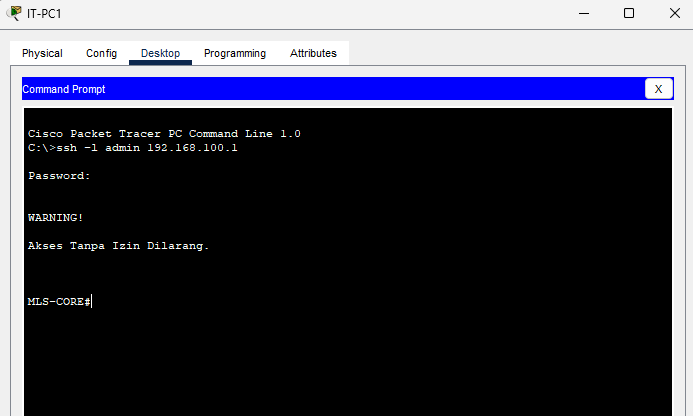
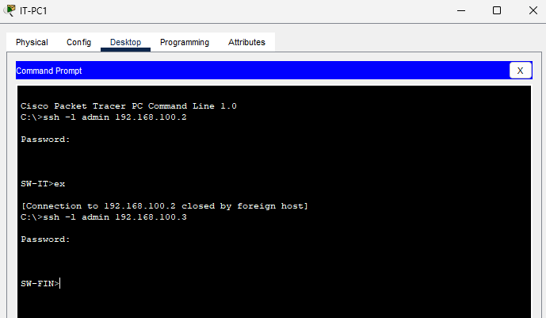
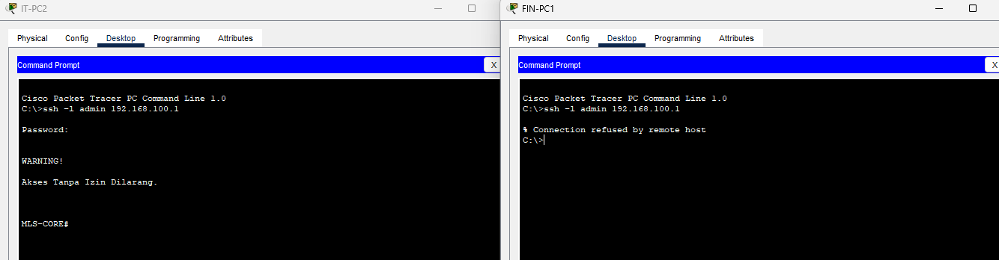
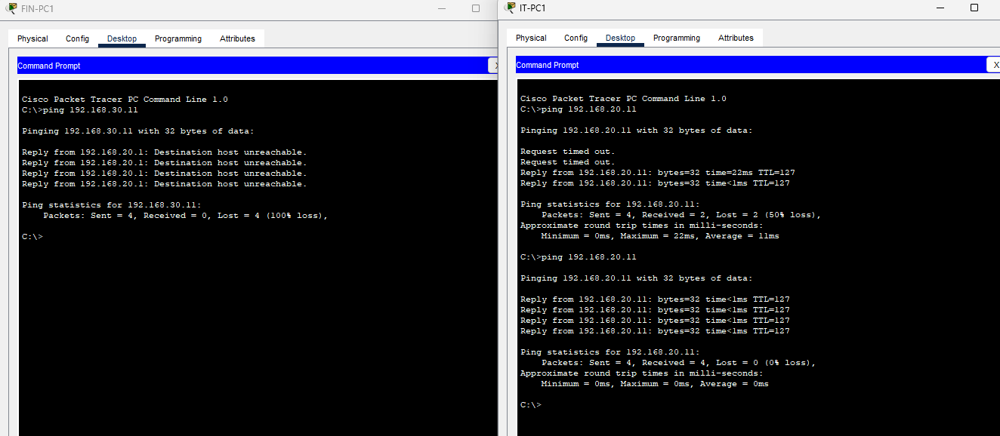
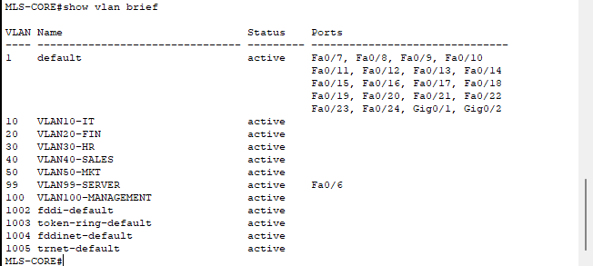
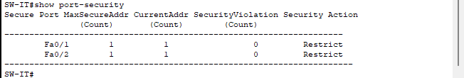
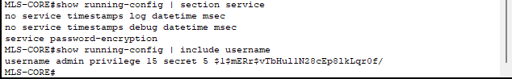
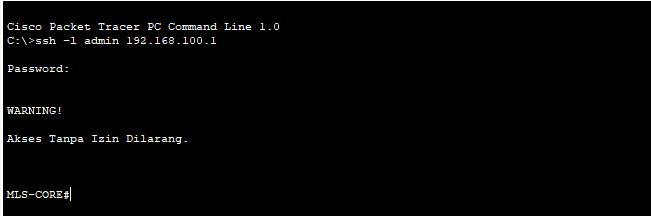
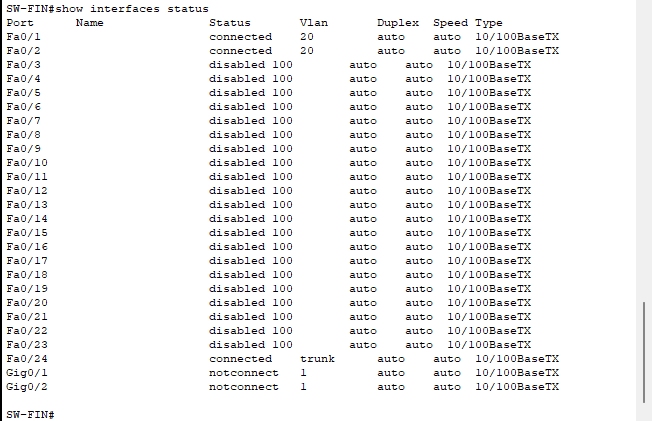

# Testing Results

## 1. Pendahuluan

Dokumen ini berisi hasil pengujian terhadap seluruh mekanisme keamanan yang diterapkan pada project **Enterprise Network Security**. Pengujian dilakukan untuk memastikan setiap konfigurasi keamanan telah berjalan sesuai dengan tujuan implementasi dan kebijakan keamanan yang telah ditetapkan.

---

## 2. Hasil Pengujian

| No |                     Pengujian                        | Status |          Referensi          |
|----|------------------------------------------------------|--------|-----------------------------|
| 1  | Login SSH ke Multilayer Switch                       | PASS   | `ssh-mls-login.png`         |
| 2  | Login SSH ke Access Switch                           | PASS   | `ssh-access-switch.png`     |
| 3  | SSH dari VLAN IT                                     | PASS   | `standard-acl-testing.png`  |
| 4  | SSH dari VLAN selain IT ditolak                      | PASS   | `standard-acl-testing.png`  |
| 5  | Komunikasi antar VLAN sesuai Extended ACL            | PASS   | `extended-acl-testing.png`  |
| 6  | Administrasi melalui Management VLAN (VLAN 100)      | PASS   | `management-vlan.png`       |
| 7  | Perangkat terdaftar dapat menggunakan access port    | PASS   | `port-security-testing.png` |
| 8  | Perangkat tidak terdaftar ditolak oleh Port Security | PASS   | `port-security-testing.png` |
| 9  | Password tersimpan dalam bentuk terenkripsi          | PASS   | `password-encryption.png`   |
| 10 | Login Banner ditampilkan sebelum autentikasi         | PASS   | `login-banner.png`          |
| 11 | Unused port berstatus shutdown                       | PASS   | `disable-unused-ports.png`  |

**Keterangan**

- **PASS** menunjukkan bahwa hasil pengujian telah sesuai dengan hasil yang diharapkan berdasarkan konfigurasi yang diterapkan.

---

## 3. Bukti Pengujian

### 3.1 Secure Shell (SSH)

---

### 3.2 Standard Access Control List (ACL)

---

### 3.3 Extended Access Control List (ACL)

---

### 3.4 Management VLAN

---

### 3.5 Port Security

---

### 3.6 Password Encryption

---

### 3.7 Login Banner

---

### 3.8 Disable Unused Ports

---

## 4. Ringkasan Hasil Pengujian

Berdasarkan seluruh skenario pengujian yang telah dilakukan, setiap mekanisme keamanan berhasil berfungsi sesuai dengan tujuan implementasinya. Pengujian menunjukkan bahwa akses administrasi telah diamankan menggunakan SSH, hak akses administrator dibatasi menggunakan ACL, perangkat jaringan dikelola melalui Management VLAN, access port diamankan menggunakan Port Security, password konfigurasi telah terenkripsi, banner keamanan berhasil ditampilkan sebelum proses autentikasi, serta port yang tidak digunakan berhasil dinonaktifkan.

Hasil pengujian ini menunjukkan bahwa implementasi keamanan pada project **Enterprise Network Security** telah berjalan sesuai dengan ruang lingkup yang direncanakan dan mendukung penerapan praktik keamanan dasar pada lingkungan jaringan enterprise.